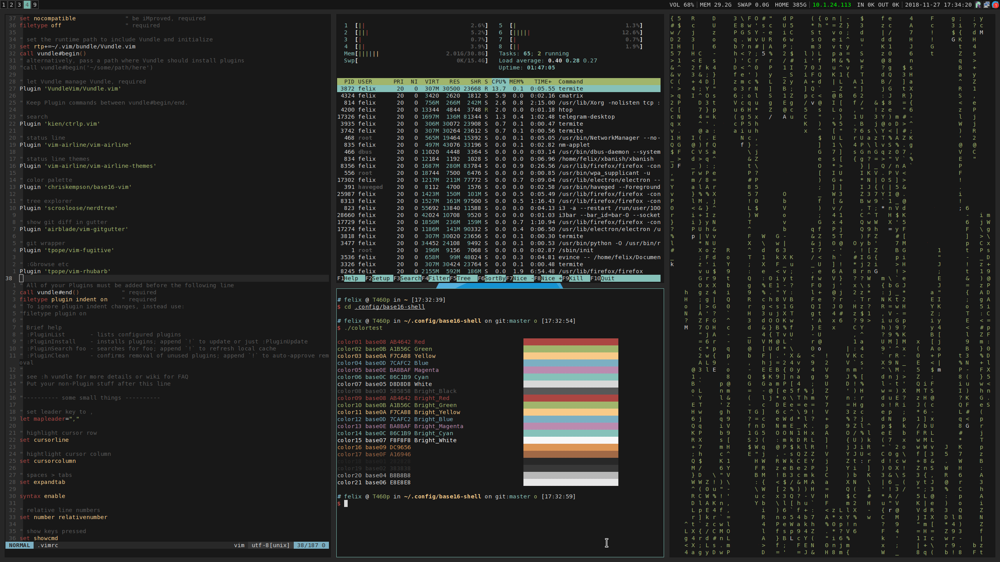

# Requirements
- zsh
- oh-my-zsh
- i3

## Optional
- i3-gaps
- termite
- vim
- vundle
- feh
- ranger
- xbanish
- xorg-xset
- xorg-setxkbmap
- xorg-xinput
- nm-applet

# Installation
Have a look at the `install.sh` script and the dotfiles before you install. Installation at your own risk.

```
git clone dotfiles git@gitlab.com:felixwege/dotfiles.git
cd dotfiles
./install
```
# Screenshot


